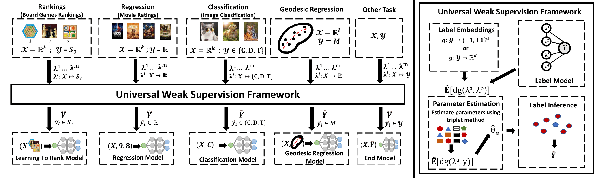

# Universalizing Weak Supervision 



This is the source code for our ICLR 2022 paper: [Universalizing Weak Supervision](https://arxiv.org/pdf/2112.03865.pdf) by Changho Shin, Winfred Li, Harit Vishwakarma, Nicholas Roberts, and Frederic Sala. We propose a universal technique that enables weak supervision over any label type while still offering desirable properties, including practicalflexibility, computational efficiency, and theoretical guarantees.


### System Requirements

* Anaconda
* Python 3.6
* Pytorch
* See environment.yml for details

### Environment Setup

We recommend you create a conda environment as follows

```
conda env create -f environment.yml
```

and activate it with

```
conda activate uws
```


### Running Experiments

* Full ranking, partial ranking experiment
  * notebooks/{boardgames, movies}/RankingExperiments.ipynb ([boardgames](https://github.com/Sala-Group/universalizing-weak-supervision/blob/master/notebooks/boardgames/RankingExperiments.ipynb), [movies](https://github.com/Sala-Group/universalizing-weak-supervision/blob/master/notebooks/movies/RankingExperiments.ipynb))
    * To play with configurations, you may look into configs {board-games, imdb-tmdb}_ranking_experiment.yaml
    * Mainly changed configurations are
      * n_train
      * n_test
      * p: null | 0.2 | 0.4 | 0.6 | 0.8 (observational probability)
      * num_LFs: 3 | 6 | 9 | 12
      * inference_rule: weighted kemeny # | snorkel | kemeny | pairwise_majority | weighted_pairwise_majority
        * Note that snorkel is our baseline. kemeny and pariwise_majority is a majority voting for full rankings, and partial rankings respectively.
  * notebooks/synthetic/Full-Rankings-Experiments-Center-Recovery.ipynb ([link](https://github.com/Sala-Group/universalizing-weak-supervision/blob/master/notebooks/synthetic/Full-Rankings-Experiments-Center-Recovery.ipynb))
  * notebooks/synthetic/Partial-Rankings-Experiments-Center-Recovery.ipynb ([link](https://github.com/Sala-Group/universalizing-weak-supervision/blob/master/notebooks/synthetic/Partial-Rankings-Experiments-Center-Recovery.ipynb))
* Regression experiment
  * notebooks/{boardgames, movies}/RegressionExperiments.ipynb ([boardgames](https://github.com/Sala-Group/universalizing-weak-supervision/blob/master/notebooks/boardgames/RegressionExperiments.ipynb)) ([movies](https://github.com/Sala-Group/universalizing-weak-supervision/blob/master/notebooks/movies/RegressionExperiments.ipynb))
  * notebooks/Regression-Experiments.ipynb ([link](https://github.com/Sala-Group/universalizing-weak-supervision/blob/master/notebooks/synthetic/Regression-Experiments.ipynb))
* Geodesic regression experiment
  * notebooks/geodesic-regression/geodesic_regression.ipynb ([link](https://github.com/Sala-Group/universalizing-weak-supervision/blob/master/notebooks/geodesic-regression/geodesic_regression.ipynb))
* Generic metric space experiment
  * notebooks/metric-spaces/generic_metric_spaces.ipynb ([link](https://github.com/Sala-Group/universalizing-weak-supervision/blob/master/notebooks/metric-spaces/generic_metric_spaces.ipynb))

### Citation
If you find our repository useful for your research, please consider citing our paper:
```
@inproceedings{shin2022universalizing,
  title={Universalizing Weak Supervision},
  author={Shin, Changho and Li, Winfred and Vishwakarma, Harit and Roberts, Nicholas Carl and Sala, Frederic},
  booktitle={The Tenth International Conference on Learning Representations},
  year={2022}
}
```
